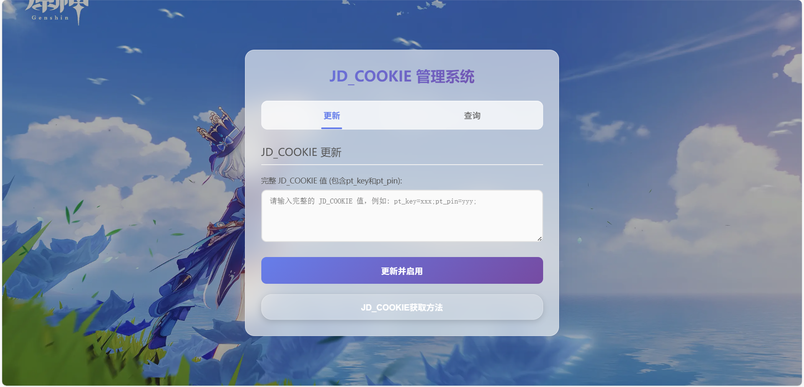
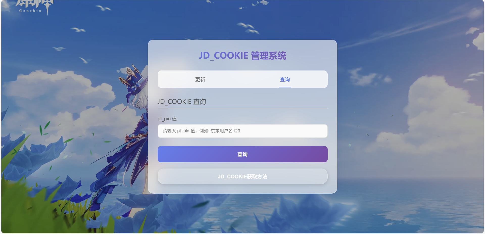

# JD_COOKIE 管理系统

本项目是一个基于 Flask 的 JD_COOKIE 管理系统，支持 JD_COOKIE 的查询与更新，适合内部使用。前端页面美观，支持 Docker 部署。





## 功能简介

- 查询 JD_COOKIE 状态（按 pt_pin 查询）
- 更新并启用 JD_COOKIE
- 限制同一 IP 每日访问次数
- 支持 Docker 一键部署

## 目录结构

```
.
├── app.py                  # Flask 主程序
├── requirements.txt        # Python 依赖
├── Dockerfile              # Docker 镜像构建文件
├── docker-compose.yml.example # Compose 示例配置
├── static/
│   ├── index.html
│   └── jdupdate.html       # 前端页面
├── .dockerignore
└── .gitignore
```

## 快速开始

### 1. 本地运行

1. 安装依赖

    ```sh
    pip install -r requirements.txt
    ```
2. 复制配置文件

```bash
cp docker-compose.yaml.example docker-compose.yaml
```

3. 设置环境变量

    - QL_HOST
    - CLIENT_ID
    - CLIENT_SECRET


### 2. Docker 部署

1. 构建镜像

    ```sh
    docker build -t jdupdate .
    ```

2. 运行容器

使用 `docker-compose.yaml`：

```sh
docker-compose up -d
```

### 3. 环境变量说明

- `QL_HOST`：青龙面板地址（如 http://192.168.192.37:5789）
- `CLIENT_ID`：青龙开放 API 的 Client ID
- `CLIENT_SECRET`：青龙开放 API 的 Client Secret

## 前端页面

访问 `/` 即可使用管理界面，支持 JD_COOKIE 查询与更新。

## 注意事项

- 本项目仅供内部学习与交流使用，请勿用于非法用途。
- 默认限制同一 IP 每日最多 7 次操作，可在 `app.py` 中修改 `MAX_DAILY_ACCESS`。

## 问题反馈及功能开发

[](https://qm.qq.com/cgi-bin/qm/qr?k=en97YqjfYaLpebd9Nn8gbSvxVrGdIXy2&jump_from=webapi&authKey=41BmkEjbGeJ81jJNdv7Bf5EDlmW8EHZeH7/nktkXYdLGpZ3ISOS7Ur4MKWXC7xIx)

## License

MIT